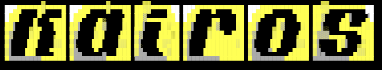
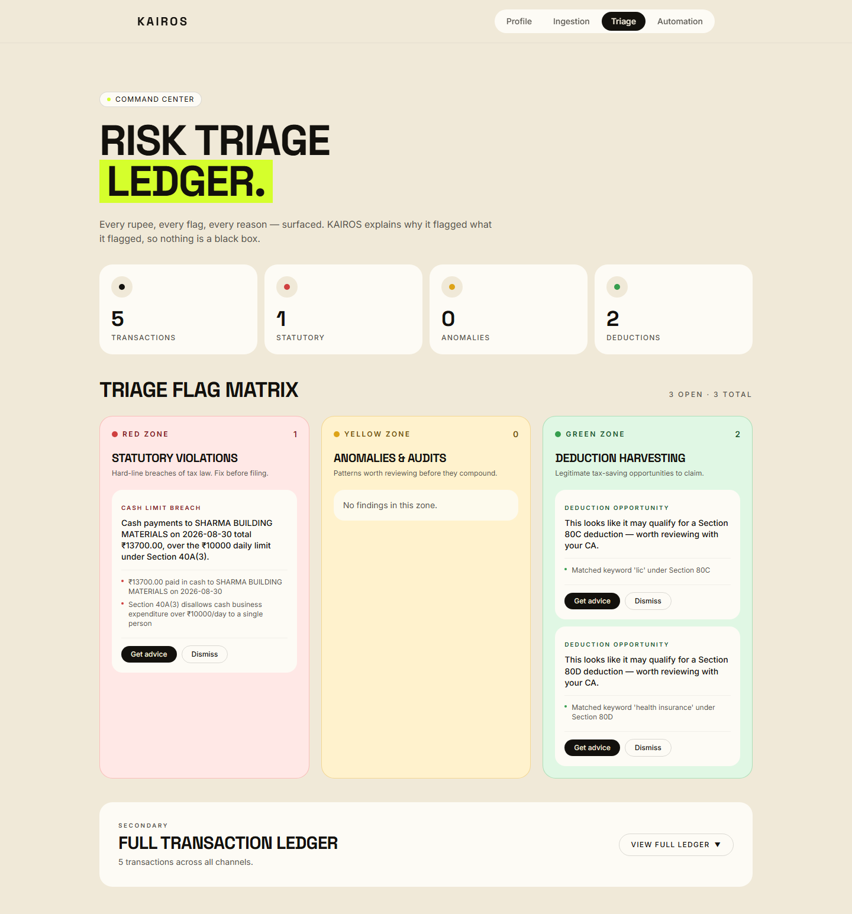
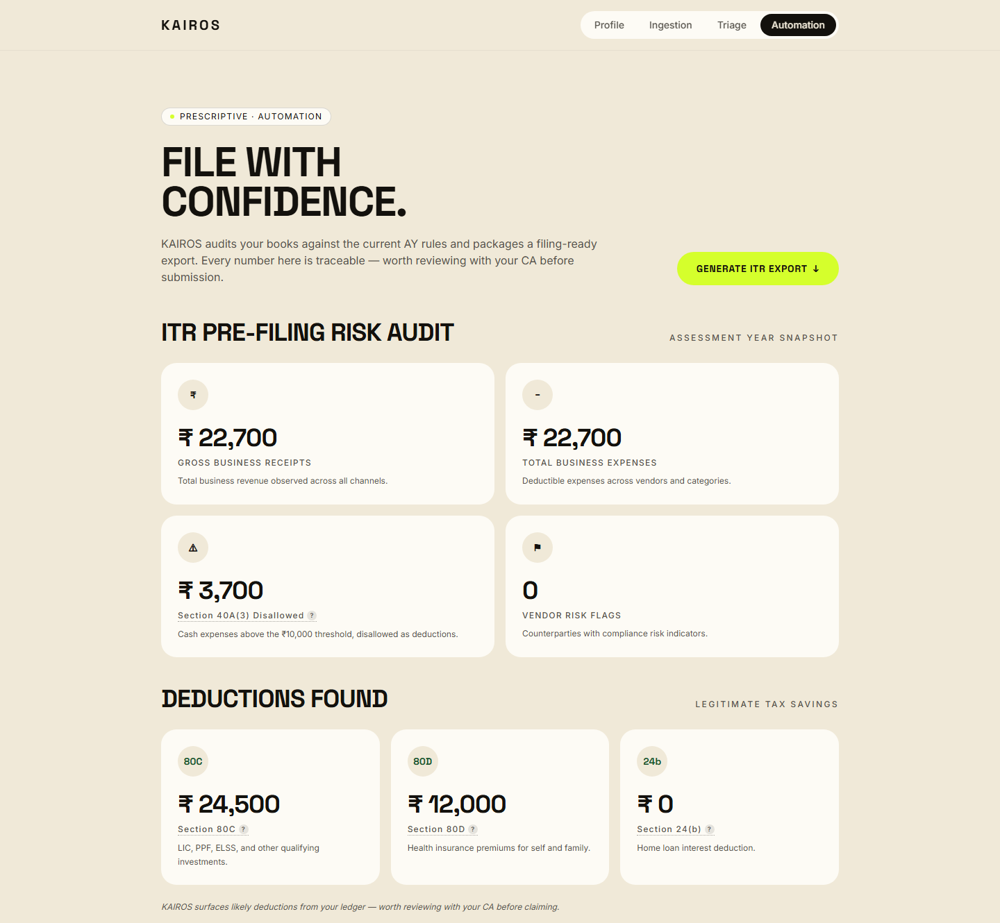
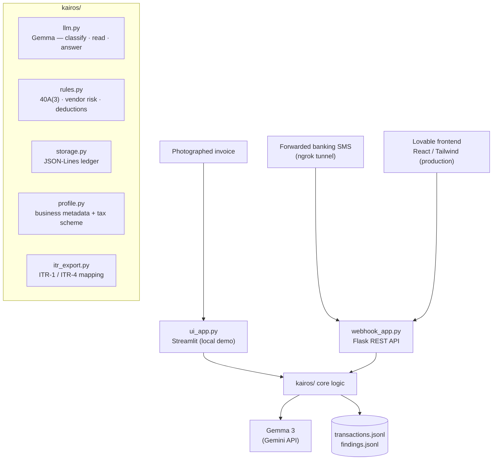

<div align="center">



**An ambient, ERP-free compliance shield for India's micro-merchants, freelancers, and gig workers.**

No ERP integration. No GSTN portal login. Just a forwarded SMS and a camera.

<br/>

[](requirements.txt)
[](webhook_app.py)
[](ui_app.py)
[](kairos/llm.py)


[Live app](https://kairos-compliance.lovable.app) · [API](https://kairos-api-i8rt.onrender.com) · [Product spec](PRODUCT.md) · [Design system](DESIGN.md)

</div>

---

## ⚡ What is KAIROS?

A solo operator — a shopkeeper, a freelancer, a gig driver — has no ERP and no accountant watching their books in real time. The compliance mistakes that cost them are small, ordinary, and only visible months later at tax time.

KAIROS watches the two signals they already generate: **forwarded banking SMS alerts** and **photographed invoices**. It reads each one with an LLM, runs it through statutory checks, and raises a flag *the moment* something is worth a second look — with the reasoning attached, never just a verdict.

> Every output is framed as *worth reviewing with your CA* — KAIROS assists, it does not give confident tax advice.

### 🔎 What it flags

| Flag | What it catches | Statute |
|:---|:---|:---|
| 🔴 **Cash-limit breach** | cash payments to one vendor crossing the daily limit | Section 40A(3) |
| 🟡 **Vendor ITC risk** | malformed / duplicate GSTINs, invoice reuse, amount anomalies | input tax credit exposure |
| 🟢 **Deduction opportunity** | unclaimed 80C / 80D / 24(b) hiding in ordinary transactions | Chapter VI-A |

---

## 📸 The app, running

> Real capture of the production UI ([kairos-compliance.lovable.app](https://kairos-compliance.lovable.app)) after five forwarded SMS messages were pushed through the live API (Gemma classification → rules engine → JSON-Lines ledger → ITR export).

**Triage** — every flag, grouped by zone, each with its reasoning:



**Automation** — the ITR pre-filing risk audit rolled up from the same ledger:



Two cash payments to the same vendor on the same day trip a **red Section 40A(3)** flag (₹13,700 total, ₹3,700 disallowed); an LIC premium and a mediclaim renewal surface as **green 80C / 80D** opportunities; the Automation page aggregates it into a filing-ready snapshot.

---

## ✨ How a message becomes a flag

- 📩 **Ingest** — `webhook_app.py` (Flask) receives a forwarded SMS on `/sms`; `ui_app.py` (Streamlit) takes a photographed invoice on the scan tab.
- 🧠 **Read** — `kairos/llm.py` sends the text (or image) to **Gemma** (`gemma-4-31b-it`, via the Gemini API) and gets back structured JSON: classification, amount, payment mode, vendor, GSTIN, invoice number.
- ⚖️ **Check** — `kairos/rules.py` runs the statutory checks: cumulative same-vendor same-day cash total vs. the ₹10,000 limit, GSTIN format + duplicate-invoice + amount-deviation scoring, and deduction-keyword matching.
- 📝 **Record** — `kairos/storage.py` appends the transaction and any findings to append-only JSON-Lines ledgers. Findings carry their `reasons` list, a severity (`red` / `yellow` / `green`), and an `acknowledged` flag.
- 💬 **Explain** — `/findings/<id>/advice` asks Gemma a follow-up about a specific finding; every answer ends with *"Worth reviewing with your CA before you act."*
- 📤 **Export** — `kairos/itr_export.py` aggregates the ledger into an ITR-1 / ITR-4 shaped JSON: gross receipts, expenses, 40A(3) disallowance, deductions by section, vendor-risk count.

---

## 🛠️ Tech Stack

| Layer | Technology |
|:---|:---|
| **API** | Flask 3.0 + flask-cors, served by Gunicorn on Render |
| **Local UI** | Streamlit 1.38 — camera scan, chat, dashboard (demo/fallback only) |
| **Production UI** | Lovable (React / Tailwind) — separate repo, calls this API via server-side proxy |
| **LLM** | `google-genai` → Gemma (`gemma-4-31b-it`) for classify / read-document / answer |
| **Storage** | append-only JSON Lines (`data/ledger.jsonl`, `data/findings.jsonl`) |
| **Ingress** | `pyngrok` tunnel for an Android SMS-forwarder to reach the local webhook |
| **Tests** | pytest — 91 tests |

---

## 🏗️ Architecture

The game the solo operator already plays — forwarding an SMS — is the only input KAIROS needs.



---

## 📂 Project Structure

```
KAIROS/
├── webhook_app.py        # Flask API — /sms /scan /profile /transactions /findings /itr/export
├── ui_app.py             # Streamlit — scan / ask / dashboard (local demo & fallback)
├── kairos/
│   ├── llm.py            # Gemma wrapper: classify_transaction · read_document_image · answer_question
│   ├── rules.py          # statutory checks: check_cash_limit · score_vendor_risk · find_deductions
│   ├── storage.py        # append-only JSON-Lines ledger + finding updates
│   ├── profile.py        # business metadata & tax scheme (regular / composition)
│   ├── itr_export.py     # ITR-1 / ITR-4 JSON aggregation
│   └── config.py         # env: GEMINI_API_KEY, NGROK_AUTHTOKEN, CASH_LIMIT_INR
├── tests/                # 91 pytest tests, one file per module + rules edge cases
├── docs/superpowers/     # product spec + design spec + implementation plans
├── render.yaml           # Render web-service definition (gunicorn)
└── run.sh                # webhook + ngrok tunnel + Streamlit, together
```

---

## 🔌 API reference

| Method | Route | Purpose |
|:---|:---|:---|
| `POST` | `/sms` | classify a forwarded SMS, run cash-limit + deduction checks |
| `POST` | `/scan` | read a photographed invoice, run vendor-risk + deduction checks |
| `GET` / `POST` | `/profile` | read or update business metadata and tax scheme |
| `GET` | `/transactions` | list transactions, optionally `?source=sms\|camera` |
| `GET` | `/findings` | list all findings |
| `PATCH` | `/findings/<id>` | acknowledge a finding |
| `POST` | `/findings/<id>/advice` | ask a follow-up question about a specific finding |
| `GET` | `/itr/export` | export transactions + findings as ITR-1 / ITR-4 JSON |

```bash
curl -X POST localhost:5000/sms -H 'Content-Type: application/json' \
  -d '{"text":"Rs 6200 paid in CASH to SHARMA BUILDING MATERIALS on 30-Aug-26"}'
```

```jsonc
// after a prior ₹7500 cash payment to the same vendor the same day:
{
  "transaction": { "amount": 6200, "payment_mode": "cash", "vendor_name": "SHARMA BUILDING MATERIALS", ... },
  "findings": [{
    "type": "cash_limit_breach", "severity": "red", "amount": 3700,
    "message": "Cash payments to SHARMA BUILDING MATERIALS on 2026-08-30 total ₹13700.00, over the ₹10000 daily limit under Section 40A(3).",
    "reasons": [
      "₹13700.00 paid in cash to SHARMA BUILDING MATERIALS on 2026-08-30",
      "Section 40A(3) disallows cash business expenditure over ₹10000/day to a single person"
    ]
  }]
}
```

```jsonc
// GET /itr/export  — after the run shown in the screenshot
{
  "gross_business_receipts": 13700.0,
  "total_business_expenses": 13700.0,
  "section_40A3_disallowed": 3700.0,
  "deductions_found": { "80C": 24500.0, "80D": 12000.0, "24b": 0.0 },
  "vendor_risk_flags": 0,
  "for_review_with_ca": true
}
```

---

## 🚀 Getting Started

### Prerequisites

- **Python 3.11+**
- a **Gemini API key** (`GEMINI_API_KEY`) — [aistudio.google.com](https://aistudio.google.com/apikey)
- *(optional)* an **ngrok authtoken** to expose the webhook to a phone

### Run

```bash
git clone https://github.com/shaktivijayas/kairos.git
cd kairos
pip install -r requirements.txt
cp .env.example .env          # fill in GEMINI_API_KEY (and NGROK_AUTHTOKEN)

./run.sh                      # webhook + ngrok tunnel + Streamlit UI together
```

`run.sh` prints the ngrok URL — point an Android SMS-forwarder app at `<ngrok-url>/sms`. Or run the pieces alone:

```bash
python webhook_app.py                 # Flask API on :5000  (+ ngrok if token set)
streamlit run ui_app.py               # UI on :8501
gunicorn webhook_app:app --bind 0.0.0.0:8000    # production-style
```

---

## 🧪 Tests

```bash
pytest
```

```
91 passed in 10.33s
```

One file per module — `rules`, `storage`, `profile`, `config`, `itr_export`, the LLM wrapper, and the webhook API — plus `test_rules_edge_cases.py` stress-testing the cash-limit and vendor-risk logic (same-vendor grouping by GSTIN vs. name, no-history fallbacks, zero-variance amount checks).

---

## 🎨 Design

The visual system — **"The Quiet Ledger"** — is one warm-neutral OKLCH surface, near-black ink, and exactly one saturated accent (**Signal Lime**, `#d7ff3f`) reserved for flagged findings. Space Grotesk for display, Inter for body. Full tokens and rules in [`DESIGN.md`](DESIGN.md); product rationale in [`PRODUCT.md`](PRODUCT.md).

The production UI is built in **Lovable** (React / Tailwind, a separate repo), live at [kairos-compliance.lovable.app](https://kairos-compliance.lovable.app); it calls this repo's API (on Render) through server-side proxies, never from browser client code. The Streamlit app here is a local demo and fallback.

---

## 📄 License

[MIT](LICENSE)
