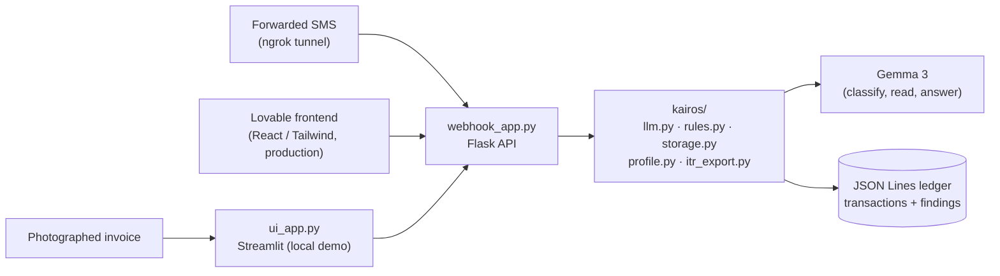

<div align="center">

# KAIROS

**An ambient, ERP-free compliance shield for India's micro-merchants, freelancers, and gig workers.**

No ERP integration. No GSTN portal login. Just a forwarded SMS and a camera.

[](LICENSE)
[](requirements.txt)
[](webhook_app.py)
[](tests)

[Live app](https://kairos-compliance.lovable.app) · [API](https://kairos-api-i8rt.onrender.com) · [Product spec](PRODUCT.md) · [Design system](DESIGN.md)

</div>

---

## What it does

KAIROS reads forwarded banking SMS alerts and photographed invoices and flags three things a solo operator would otherwise catch too late:

| Flag | What it catches |
|---|---|
| **Cash-limit breach** | Section 40A(3) — cash payments over the statutory limit |
| **Vendor ITC risk** | Malformed or suspicious GSTINs that put input tax credit at risk |
| **Deduction opportunity** | Unclaimed 80C / 80D / 24b deductions hiding in ordinary transactions |

Every flag ships with the reasoning behind it — never just a verdict — and every output is framed as *worth reviewing with your CA*, not confident tax advice. KAIROS also answers direct "is this okay?" questions before you act.

## Architecture



- **`webhook_app.py`** (Flask) — receives forwarded SMS, serves the REST API consumed by the production frontend
- **`ui_app.py`** (Streamlit) — camera scan, chat, and dashboard; local fallback/demo only
- **`kairos/`** — shared logic:
  - `llm.py` — Gemma 3 wrapper for classify / read-document / answer
  - `rules.py` — statutory checks (cash limit, vendor risk, deductions)
  - `storage.py` — JSON Lines ledger for transactions and findings
  - `profile.py` — business metadata and tax scheme
  - `itr_export.py` — ITR-1 / ITR-4 JSON export mapping

## Frontend

The production UI is built in **Lovable** (React/Tailwind) — not this repo. It's live at [kairos-compliance.lovable.app](https://kairos-compliance.lovable.app) and calls this repo's Flask API (deployed to Render at [kairos-api-i8rt.onrender.com](https://kairos-api-i8rt.onrender.com)) through server-side proxies, never directly from browser client code.

The visual system — **"The Quiet Ledger"** — is one warm-neutral surface, near-black ink, and exactly one saturated accent (Signal Lime) reserved for flagged findings. Full tokens and rules in [`DESIGN.md`](DESIGN.md).

## API reference

| Method | Route | Purpose |
|---|---|---|
| `POST` | `/sms` | Classify a forwarded SMS, run cash-limit + deduction checks |
| `POST` | `/scan` | Read a photographed invoice, run vendor-risk + deduction checks |
| `GET` / `POST` | `/profile` | Read or update business metadata and tax scheme |
| `GET` | `/transactions` | List transactions, optionally filtered by `source` |
| `GET` | `/findings` | List all findings |
| `PATCH` | `/findings/<id>` | Acknowledge a finding |
| `POST` | `/findings/<id>/advice` | Ask a follow-up question about a specific finding |
| `GET` | `/itr/export` | Export transactions + findings as ITR-1/ITR-4 JSON |

## Setup

```bash
pip install -r requirements.txt
cp .env.example .env   # fill in GEMINI_API_KEY and NGROK_AUTHTOKEN
./run.sh
```

This starts the SMS webhook — its ngrok tunnel URL prints to the console — alongside the Streamlit UI. Point an Android SMS-forwarder app at the printed ngrok URL + `/sms`.

## Testing

```bash
pytest
```

91 tests across rules, storage, profile, config, ITR export, the LLM wrapper, and the webhook API — including edge-case stress tests for the rules engine.

## License

[MIT](LICENSE)
